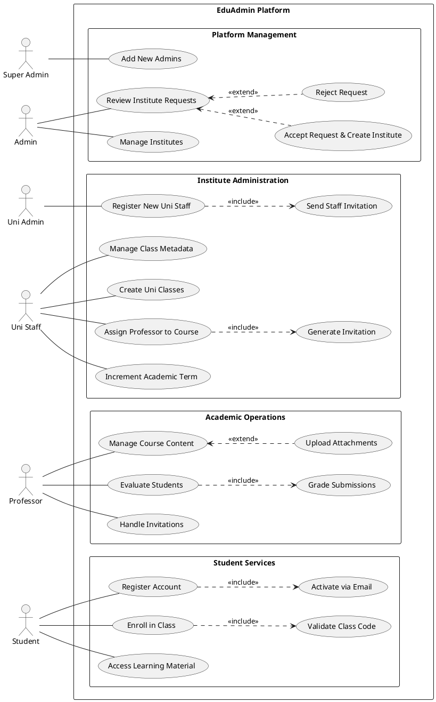
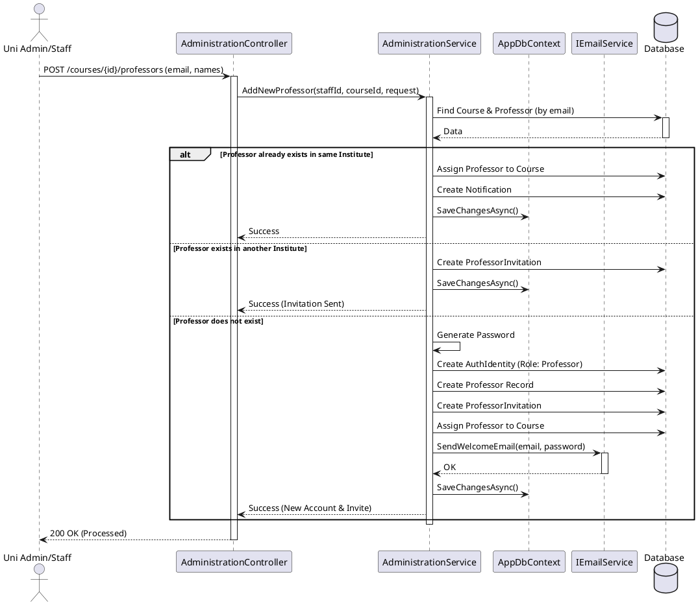
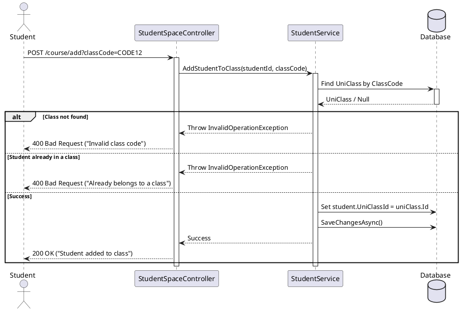

# Project UML Diagrams

## 1. Use Case Diagram (Refactored)

---

## 2. Sequence Diagram: Adding a Professor to a Course

This diagram covers the flow where a Uni Admin or Staff adds a professor to a specific course. It handles both existing and new professors.

---

## 3. Sequence Diagram: Student Joining a Class via Code

This diagram shows how a student joins a class using a unique 6-character class code.

